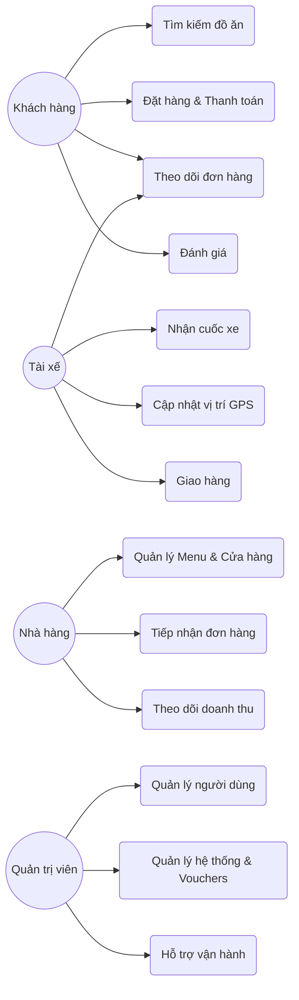
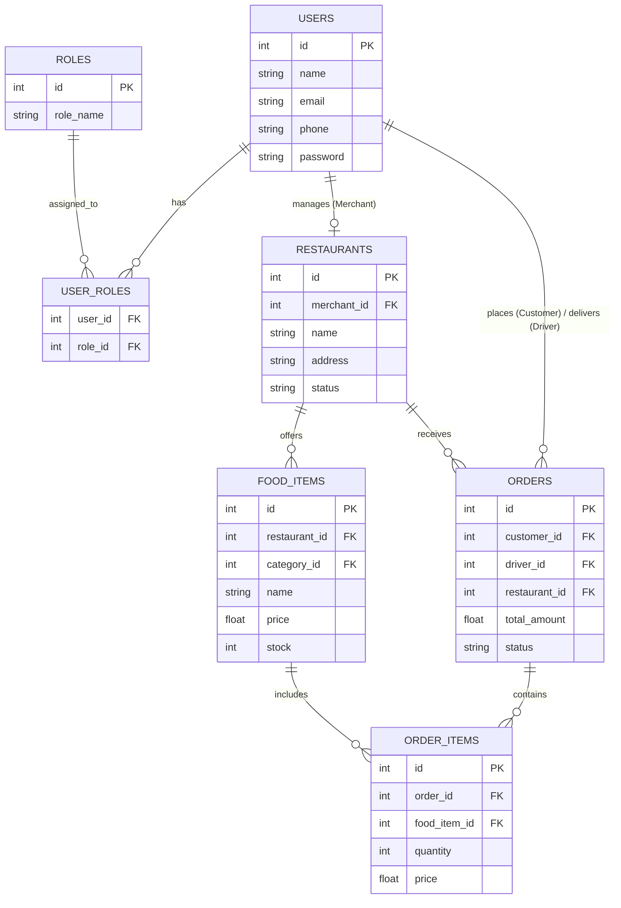
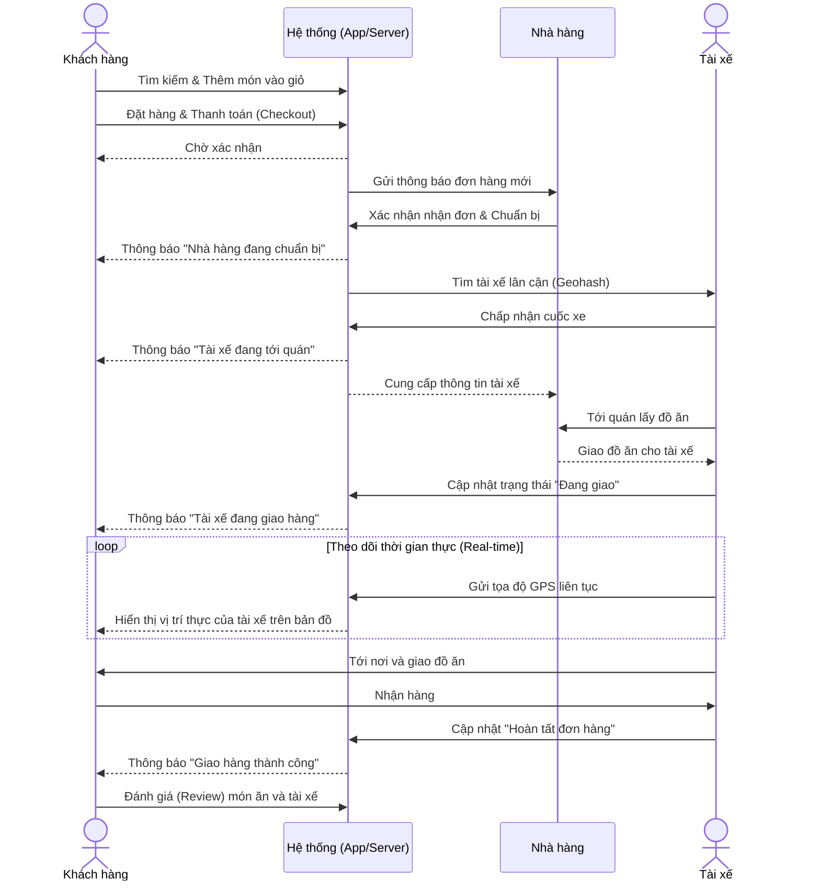

# Tài liệu Phân tích Dự án ShopeeFood / GrabFood Clone

Dựa trên việc phân tích mã nguồn và tài liệu của dự án, dưới đây là 3 phần chính bao gồm danh sách các đối tượng, chức năng của từng đối tượng và thiết kế cơ sở dữ liệu của hệ thống:

## 1. Đối tượng sử dụng phần mềm (Actors)
Hệ thống xoay quanh 4 đối tượng người dùng chính:
1. **Khách hàng (Customer):** Người sử dụng ứng dụng để tìm kiếm và đặt đồ ăn.
2. **Tài xế (Driver):** Người vận chuyển đơn hàng từ nhà hàng đến tay khách hàng.
3. **Nhà hàng / Đối tác bán hàng (Merchant):** Chủ cửa hàng, quản lý thực đơn và tiếp nhận đơn hàng.
4. **Quản trị viên (Admin / Order Ops):** Người giám sát, quản lý toàn bộ hệ thống và hỗ trợ xử lý sự cố.

---

## 2. Chức năng chi tiết của từng đối tượng

### Biểu đồ Use Case (Tổng quan)

### 2.1. Khách hàng (Customer)
- **Tìm kiếm & Khám phá:** Tìm kiếm nhà hàng, danh mục món ăn (có hỗ trợ bộ lọc và gợi ý vị trí).
- **Đặt hàng (Checkout):** Thêm món vào giỏ hàng, tính toán phí ship, áp dụng voucher (nếu có) và tiến hành đặt hàng.
- **Theo dõi thời gian thực (Real-time Tracking):** Xem trạng thái đơn hàng cập nhật liên tục và theo dõi vị trí tài xế trực tiếp trên bản đồ (thông qua Socket.io).
- **Quản lý cá nhân:** Xem lịch sử đơn hàng, cập nhật thông tin cá nhân.
- **Đánh giá (Review):** Để lại đánh giá cho món ăn hoặc tài xế sau khi hoàn thành đơn.

### 2.2. Tài xế (Driver)
- **Quản lý hoạt động:** Bật/tắt trạng thái hoạt động (Online / Offline) để sẵn sàng nhận cuốc.
- **Quản lý thông tin:** Xem và cập nhật hồ sơ cá nhân, phương tiện (loại xe, biển số).
- **Xử lý đơn hàng:**
  - Nhận thông báo cuốc xe mới dựa trên thuật toán tìm kiếm tài xế lân cận (Geohash).
  - Thao tác quy trình giao hàng: Chấp nhận cuốc -> Tới quán lấy hàng -> Đang giao hàng -> Hoàn tất.
- **Gửi vị trí GPS:** Cập nhật liên tục vị trí hiện tại lên hệ thống để chia sẻ cho khách hàng.

### 2.3. Nhà hàng (Merchant)
- **Quản lý Cửa hàng:** Đóng/mở cửa, cập nhật thông tin nhà hàng (địa chỉ, hình ảnh).
- **Quản lý Menu:** Thêm, sửa, xóa danh mục và món ăn (quản lý cả tồn kho thời gian thực).
- **Tiếp nhận đơn hàng:** Xác nhận khi có đơn mới từ khách hàng, chuẩn bị món ăn.
- **Theo dõi kinh doanh:** Xem bảng điều khiển (dashboard) trạng thái các đơn hàng, doanh thu.

### 2.4. Quản trị viên (Admin)
- **Quản lý người dùng:** CRUD thông tin Customer, Driver, Merchant.
- **Vận hành hệ thống:** Can thiệp cập nhật trạng thái đơn (xác nhận, hủy bỏ nếu có sự cố), giải quyết tranh chấp.
- **Quản lý danh mục & Cấu hình:** Quản lý mã giảm giá (vouchers), phê duyệt các yêu cầu thay đổi thông tin từ Nhà hàng (`restaurant_change_requests`), cài đặt hệ thống.

---

## 3. Thiết kế Cơ sở dữ liệu (Database Schema)

Cơ sở dữ liệu (MySQL) được thiết kế xoay quanh kiến trúc monolith đáp ứng các quy trình nghiệp vụ trên, bao gồm các bảng (tables) chính sau:

### Lược đồ Thực thể Liên kết (ERD)

### 3.1. Phân hệ Tài khoản và Người dùng
- `users`: Thông tin tài khoản đăng nhập và profile chung.
- `roles`: Bảng danh mục các vai trò (Customer, Driver, Merchant, Admin).
- `user_roles`: Bảng trung gian gán vai trò cho người dùng.
- `driver_details`: Chi tiết đặc thù của tài xế (xe, biển số, rating).
- `merchant_details`: Chi tiết đặc thù của đối tác nhà hàng.
- `system_settings`: Cấu hình chung của toàn hệ thống.

### 3.2. Phân hệ Quản lý Nhà hàng & Thực đơn
- `restaurants`: Thông tin chi tiết của các quán ăn, nhà hàng.
- `categories`: Danh mục phân loại món ăn (Ví dụ: Đồ uống, Đồ ăn nhanh...).
- `food_items`: Lưu trữ thông tin từng món ăn (tên, giá cả, số lượng tồn kho).
- `restaurant_change_requests`: Các yêu cầu chỉnh sửa/cập nhật thông tin quán từ Merchant cần Admin duyệt.
- `reviews`: Lưu trữ các đánh giá, phản hồi của người dùng.
- `vouchers`: Quản lý các mã giảm giá áp dụng cho đơn hàng.

### 3.3. Phân hệ Xử lý Đơn hàng & Tracking (Trọng tâm)
- `orders`: Thông tin chung của một đơn đặt hàng (Customer ID, Driver ID, Merchant ID, tổng tiền, phí ship).
- `order_items`: Thông tin chi tiết các món ăn có bên trong đơn hàng.
- `order_statuses`: Danh mục chuẩn các trạng thái đơn hàng (PENDING, CONFIRMED, DELIVERING...).
- `order_status_logs`: Lưu vết lịch sử chuyển đổi trạng thái của đơn hàng.
- `driver_locations`: Lưu trữ vị trí (tọa độ GPS) hiện tại của tài xế, sử dụng index `geohash` để hỗ trợ truy vấn tìm kiếm tài xế lân cận cực nhanh.

### 3.4. Phân hệ Thanh toán
- `payments`: Lưu trữ thông tin thanh toán tổng quan của đơn hàng.
- `payment_transactions`: Lưu lịch sử chi tiết các giao dịch thanh toán.

Thiết kế DB này áp dụng tốt các cơ chế Transaction và Locking để đảm bảo không bị Race Condition (đặc biệt tại luồng đặt đơn và cập nhật số lượng món ăn).

---

## 4. Biểu đồ Tuần tự (Sequence Diagram) - Luồng Đặt Hàng & Giao Hàng

Dưới đây là biểu đồ tuần tự mô tả luồng chính từ khi Khách hàng đặt đơn, Nhà hàng tiếp nhận cho đến khi Tài xế nhận cuốc và giao hàng hoàn tất:

