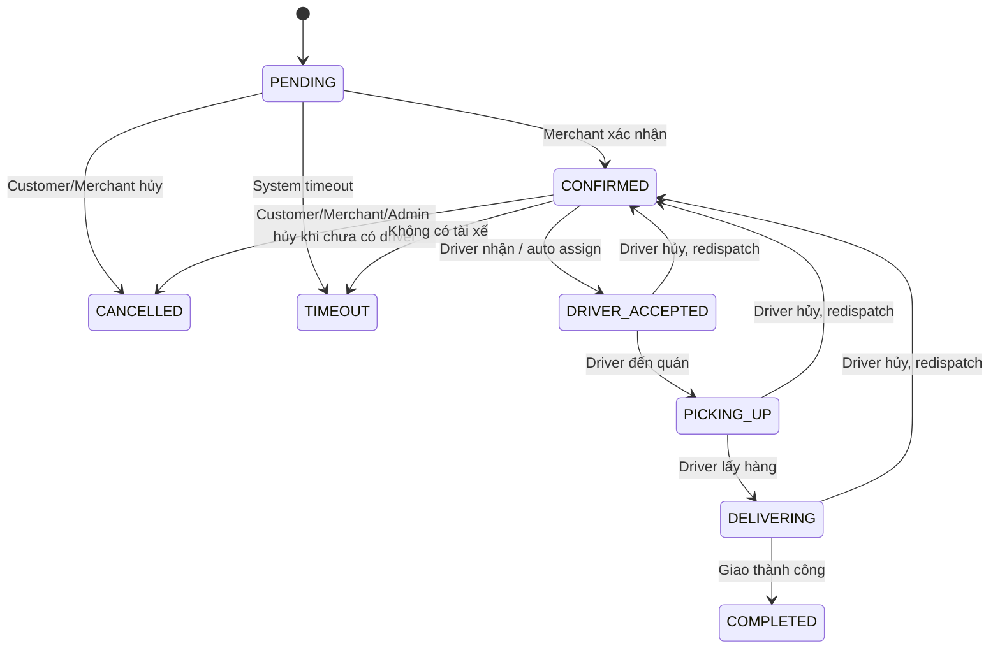

# Tài liệu đặc tả yêu cầu phần mềm (SRS)

**Dự án:** ShopeeFood / GrabFood Clone  
**Thành phần:** Backend monolith, web client, realtime tracking, admin/merchant/driver/customer workflows  
**Phiên bản tài liệu:** 2.0  
**Ngày cập nhật:** 29/06/2026  
**Trạng thái:** Hoàn chỉnh theo hiện trạng mã nguồn

---

## 1. Giới thiệu

### 1.1 Mục đích

Tài liệu này đặc tả đầy đủ yêu cầu phần mềm cho hệ thống ShopeeFood / GrabFood Clone. SRS được dùng làm cơ sở để:

- Thống nhất phạm vi chức năng giữa khách hàng, nhóm phát triển, kiểm thử và người chấm đồ án.
- Đối chiếu các module đã triển khai trong backend `grab-food-monolith` và web client `client/fe_fegrapfood`.
- Hỗ trợ kiểm thử API, kiểm thử nghiệp vụ, bảo trì, mở rộng và trình bày dự án.

### 1.2 Phạm vi hệ thống

Hệ thống mô phỏng nền tảng đặt món và giao đồ ăn nhiều vai trò, gồm:

- Khách hàng duyệt nhà hàng, chọn món, chọn topping, áp voucher, tạo đơn, thanh toán mock và theo dõi đơn realtime.
- Nhà hàng/merchant quản lý thông tin nhà hàng, trạng thái mở cửa, danh mục, món ăn, topping và xử lý đơn.
- Tài xế quản lý trạng thái online, nhận/từ chối/hủy đơn, cập nhật vị trí, xem hiệu suất AR/CR/rating.
- Admin quản trị người dùng, merchant, nhà hàng, đơn hàng, voucher, cài đặt hệ thống, hồ sơ duyệt đối tác và hiệu suất tài xế.
- Backend cung cấp REST API, Socket.IO realtime, EJS dashboard nội bộ, MySQL database và seed data demo.

Phạm vi hiện tại tập trung vào môi trường local/demo. Hệ thống chưa phải nền tảng production quy mô lớn, nhưng SRS mô tả theo chuẩn dự án thật để có thể phát triển tiếp.

### 1.3 Đối tượng sử dụng tài liệu

- Product Owner hoặc người ra đề.
- Backend developer.
- Frontend developer.
- Tester/QA.
- Admin vận hành demo.
- Giảng viên/hội đồng đánh giá đồ án.

### 1.4 Thuật ngữ

| Thuật ngữ | Ý nghĩa |
| --- | --- |
| Customer | Khách hàng đặt món |
| Merchant | Chủ nhà hàng hoặc nhân viên quản lý nhà hàng |
| Driver | Tài xế giao hàng |
| Admin | Quản trị viên hệ thống |
| Order | Đơn đặt món |
| Offer | Lượt hệ thống phát đơn đến tài xế |
| AR | Acceptance Rate, tỷ lệ nhận offer của tài xế |
| CR | Cancellation Rate, tỷ lệ hủy đơn đã nhận của tài xế |
| Idempotency key | Khóa chống tạo trùng request |
| Optimistic locking | Kiểm soát xung đột bằng trường `version` |
| Pessimistic locking | Khóa dòng CSDL trong transaction khi xử lý cạnh tranh |
| Socket room | Phòng realtime riêng theo đơn/tài xế/khách hàng |

### 1.5 Tài liệu và mã nguồn tham chiếu

- `grab-food-monolith/src/routes/*`
- `grab-food-monolith/src/controllers/*`
- `grab-food-monolith/src/models/*`
- `grab-food-monolith/src/services/*`
- `grab-food-monolith/db_structure.md`
- `client/fe_fegrapfood/src/routes/AppRouter.tsx`
- `client/fe_fegrapfood/src/services/api/*`
- `DRIVER_PERFORMANCE_PRD.md`
- `BAO_VE_MODULE_DAT_HANG.md`

---

## 2. Mô tả tổng quan

### 2.1 Bối cảnh sản phẩm

ShopeeFood / GrabFood Clone là hệ thống đặt món theo mô hình marketplace ba bên: khách hàng, nhà hàng và tài xế. Backend đóng vai trò trung tâm điều phối dữ liệu, trạng thái đơn, thanh toán mock, vị trí tài xế và phân quyền. Web client cung cấp các màn hình thao tác tương ứng cho từng vai trò.

### 2.2 Kiến trúc tổng thể

Hệ thống được tổ chức theo kiến trúc monolith backend kết hợp SPA frontend:

| Lớp | Công nghệ | Trách nhiệm |
| --- | --- | --- |
| Web client | React, Vite, TypeScript, TailwindCSS, React Router | Giao diện khách hàng, tài xế, merchant, admin |
| Backend API | Node.js, Express | REST API, validation, business logic, auth, role-based access |
| Realtime | Socket.IO | Cập nhật đơn, dispatch, vị trí tài xế, thông báo realtime |
| ORM | Sequelize | Model, association, transaction, locking |
| Database | MySQL | Lưu người dùng, nhà hàng, menu, đơn, thanh toán, vị trí, review |
| Internal views | EJS | Trang dashboard/debug nội bộ |
| Map/address | Leaflet phía FE, VietMap/Nominatim/OSRM phía BE | Gợi ý địa chỉ, reverse geocode, tuyến đường |

### 2.3 Thành phần backend

- `server.js`: bootstrap server, khởi tạo database, Socket.IO và scheduled jobs.
- `src/app.js`: cấu hình Express, CORS, JSON parser, static files, EJS views.
- `src/routes`: định nghĩa endpoint REST và page route.
- `src/controllers`: xử lý request/response.
- `src/services`: nghiệp vụ điều phối tài xế, tính phí ship, timeout, reset tồn kho, hiệu suất tài xế.
- `src/models`: Sequelize model và quan hệ dữ liệu.
- `src/modules/address`: module địa chỉ có provider VietMap/Nominatim.
- `src/sockets`: cấu hình Socket.IO rooms/events.

### 2.4 Thành phần frontend

Các route chính của web client:

| Route | Vai trò | Mục đích |
| --- | --- | --- |
| `/` | Public/role-based | Portal và redirect theo vai trò |
| `/food` | Customer/public | Trang đặt món chính |
| `/restaurants` | Public | Duyệt danh sách nhà hàng |
| `/restaurants/:id` | Customer/public | Chi tiết nhà hàng, giỏ hàng, checkout |
| `/payment` | Customer | Thanh toán đơn |
| `/payment/qr` | Customer | Thanh toán QR/mock |
| `/tracking` | Customer | Theo dõi đơn realtime |
| `/driver` | Driver/Admin | Màn hình nhận/giao đơn, hiệu suất, lịch sử |
| `/merchant/orders` | Merchant | Quản lý đơn của nhà hàng |
| `/merchant/menu` | Merchant | Quản lý menu, món, topping |
| `/admin` | Admin | Bảng quản trị |
| `/profile` | Authenticated | Hồ sơ, đổi mật khẩu, địa chỉ |
| `/login`, `/merchant/login`, `/driver/login`, `/admin/login` | Theo vai trò | Đăng nhập |
| `/register` | Customer | Đăng ký khách hàng |
| `/mock-gateway/:paymentId` | Customer/demo | Cổng thanh toán mock |

### 2.5 Vai trò người dùng

| Vai trò | Quyền chính |
| --- | --- |
| CUSTOMER | Đăng ký, đăng nhập, quản lý hồ sơ/địa chỉ, đặt món, thanh toán, hủy đơn khi chưa có tài xế, đánh giá đơn hoàn thành |
| MERCHANT | Quản lý nhà hàng thuộc sở hữu, menu, topping, mở/đóng quán, xác nhận/từ chối đơn, theo dõi đơn của nhà hàng |
| DRIVER | Bật/tắt online, cập nhật vị trí, xem offer/đơn được gán, nhận/từ chối/hủy đơn, chuyển trạng thái giao hàng, xem hiệu suất |
| ADMIN | Quản trị toàn hệ thống: user, merchant, nhà hàng, đơn, voucher, settings, duyệt đối tác, xem/thu hồi penalty tài xế |

### 2.6 Giả định và ràng buộc

- Mỗi user hiện chỉ giữ một role hiệu lực trong bảng `user_roles`.
- Số điện thoại là định danh đăng nhập chính và phải duy nhất.
- Mật khẩu được hash bằng scrypt; dữ liệu cũ dạng plain text được tự nâng cấp khi login thành công.
- Token xác thực là bearer token tự ký bằng HMAC-SHA256, TTL mặc định 24 giờ.
- Database mặc định là MySQL `grabfood_db`.
- Hệ thống địa chỉ gọi qua backend; frontend không lưu hoặc gọi trực tiếp API key VietMap.
- Payment là mock gateway, chưa tích hợp ví/ngân hàng thật.
- Socket.IO dùng cho demo realtime; xác thực socket hiện dựa vào logic join room phía client/server, chưa phải security boundary production hoàn chỉnh.

---

## 3. Yêu cầu chức năng

### 3.1 Xác thực và phân quyền

| Mã | Yêu cầu |
| --- | --- |
| FR-AUTH-01 | Customer có thể đăng ký tài khoản bằng `fullName`, `phone`, `password`. |
| FR-AUTH-02 | Hệ thống phải kiểm tra số điện thoại Việt Nam dạng `0xxxxxxxxx`, không trùng và mật khẩu dài 6-72 ký tự, gồm chữ và số. |
| FR-AUTH-03 | Người dùng đăng nhập bằng `phone`, `password`, `role`; role yêu cầu phải trùng role tài khoản. |
| FR-AUTH-04 | Sau đăng nhập thành công, hệ thống trả token bearer và thông tin user chuẩn hóa. |
| FR-AUTH-05 | Người dùng đã đăng nhập xem thông tin `/me`, cập nhật hồ sơ và đổi mật khẩu. |
| FR-AUTH-06 | Người dùng có thể đồng bộ/activate role hiện tại để lấy token mới. |
| FR-AUTH-07 | Hệ thống hỗ trợ quên mật khẩu bằng OTP in-memory, gửi qua `SMS_WEBHOOK_URL` hoặc trả `devOtp` khi `ALLOW_DEV_OTP=true`. |
| FR-AUTH-08 | Middleware `auth` phải trả `401` khi thiếu/sai/hết hạn token. |
| FR-AUTH-09 | Middleware `requireRole` phải trả `403` khi user không có role được phép. |

### 3.2 Quản lý người dùng

| Mã | Yêu cầu |
| --- | --- |
| FR-USER-01 | Admin xem danh sách user và chi tiết user. |
| FR-USER-02 | Admin tạo user mới với role hợp lệ, mật khẩu mặc định nếu không truyền là `123456`. |
| FR-USER-03 | Admin cập nhật thông tin, rating và role của user. |
| FR-USER-04 | Admin xóa user. |
| FR-USER-05 | Admin xem danh sách merchant và tạo merchant nhanh. |
| FR-USER-06 | User đã đăng nhập xem profile của chính mình qua `/api/users/me`. |

### 3.3 Đăng ký và duyệt đối tác

| Mã | Yêu cầu |
| --- | --- |
| FR-APP-01 | Customer có thể gửi hồ sơ đăng ký tài xế gồm biển số, CMND/CCCD và loại xe. |
| FR-APP-02 | Customer có thể gửi hồ sơ đăng ký merchant kèm thông tin nhà hàng đầu tiên. |
| FR-APP-03 | Hệ thống không cho gửi trùng hồ sơ đang `PENDING` hoặc đã `APPROVED`. |
| FR-APP-04 | User xem được trạng thái hồ sơ của mình: role hiện tại, driver application, nhà hàng pending/approved. |
| FR-APP-05 | Admin xem danh sách hồ sơ tài xế đang chờ duyệt. |
| FR-APP-06 | Admin duyệt/từ chối tài xế; khi duyệt, user được chuyển role `DRIVER`. |
| FR-APP-07 | Admin duyệt/từ chối nhà hàng; khi tạo/duyệt bởi admin, owner có thể được gán role `MERCHANT`. |
| FR-APP-08 | Khi từ chối hồ sơ, hệ thống lưu `rejectReason`. |

### 3.4 Quản lý nhà hàng

| Mã | Yêu cầu |
| --- | --- |
| FR-RES-01 | Public/customer xem danh sách nhà hàng đã `APPROVED`; admin có thể xem cả pending bằng query. |
| FR-RES-02 | Public xem chi tiết nhà hàng theo id, gồm thông tin menu liên quan khi cần. |
| FR-RES-03 | Merchant xem danh sách nhà hàng của mình. |
| FR-RES-04 | Admin hoặc merchant tạo nhà hàng với `ownerId`, tên, địa chỉ, tọa độ, giờ mở/đóng, ảnh. |
| FR-RES-05 | Nhà hàng tạo bởi merchant mặc định `PENDING`; nhà hàng tạo bởi admin có thể `APPROVED`. |
| FR-RES-06 | Merchant chỉ quản lý nhà hàng thuộc sở hữu. |
| FR-RES-07 | Merchant cập nhật các trường vận hành như `isOpen`, `isOpenToday`, `temporaryClosedReason`, `temporaryClosedUntil`. |
| FR-RES-08 | Merchant thay đổi các trường nhạy cảm như owner, tên, địa chỉ, tọa độ, ảnh, rating phải tạo `RestaurantChangeRequest` chờ admin duyệt, trừ các cập nhật được hệ thống cho phép trực tiếp. |
| FR-RES-09 | Admin duyệt/từ chối nhà hàng pending. |
| FR-RES-10 | Admin duyệt/từ chối change request; khi duyệt, payload được áp vào nhà hàng. |
| FR-RES-11 | Xóa nhà hàng là soft delete bằng `deletedAt`. |
| FR-RES-12 | Nhà hàng chỉ nhận đơn khi `isOpen=true` và `approvalStatus=APPROVED`. |

### 3.5 Quản lý danh mục, món ăn và topping

| Mã | Yêu cầu |
| --- | --- |
| FR-MENU-01 | Public xem danh sách danh mục và món ăn. |
| FR-MENU-02 | Admin/merchant tạo, cập nhật, xóa danh mục. |
| FR-MENU-03 | Admin/merchant tạo, cập nhật, xóa món ăn. |
| FR-MENU-04 | Món ăn có giá, ảnh, trạng thái bán, tồn kho mặc định, tồn kho hiện tại và ngày reset tồn kho. |
| FR-MENU-05 | Topping thuộc nhà hàng, có giá, trạng thái bán, tồn kho, ngày bắt đầu/kết thúc bán. |
| FR-MENU-06 | Admin/merchant tạo, cập nhật, xóa topping của nhà hàng. |
| FR-MENU-07 | Admin/merchant gán danh sách topping hợp lệ cho món ăn. |
| FR-MENU-08 | Hệ thống tự reset tồn kho món ăn/topping theo ngày khi job chạy hoặc khi tạo đơn. |
| FR-MENU-09 | Món ăn/topping xóa phải dùng soft delete nếu model hỗ trợ `deletedAt`. |
| FR-MENU-10 | Khi tạo đơn, hệ thống lưu snapshot `foodName`, `priceAtOrder`, `toppingName`, `priceAtOrder` để bảo toàn lịch sử giá. |

### 3.6 Giỏ hàng, tạo đơn và tính tiền

| Mã | Yêu cầu |
| --- | --- |
| FR-ORDER-01 | Chỉ CUSTOMER được tạo đơn. |
| FR-ORDER-02 | Đơn phải có `restaurantId`, tọa độ giao hàng `receiverLat`, `receiverLng`, `distanceKm` hợp lệ. |
| FR-ORDER-03 | `items` nếu truyền phải là mảng không rỗng, mỗi item có `foodId` và `quantity > 0`. |
| FR-ORDER-04 | Các item trùng món và cùng cấu hình topping được gộp số lượng trước khi xử lý. |
| FR-ORDER-05 | Món trong đơn phải thuộc nhà hàng được đặt, còn bán và còn đủ tồn kho. |
| FR-ORDER-06 | Topping phải thuộc món, còn bán, trong thời gian bán và còn đủ tồn kho. |
| FR-ORDER-07 | Hệ thống phải trừ tồn kho món/topping trong transaction; nếu thiếu hàng thì rollback và trả `409`. |
| FR-ORDER-08 | Đơn sử dụng `idempotencyKey` để tránh tạo trùng; request lặp trả lại đơn cũ. |
| FR-ORDER-09 | `subtotalAmount` bằng tổng tiền món và topping sau khi snapshot giá. |
| FR-ORDER-10 | `shippingFee` được tính theo `shippingType`: `STANDARD`, `FAST`, `ECO`. |
| FR-ORDER-11 | `totalAmount = max(0, subtotalAmount + shippingFee + taxAmount - discountAmount)`. |
| FR-ORDER-12 | Nếu có `voucherId`, hệ thống xác thực voucher và tự tính discount thực tế trong transaction. |
| FR-ORDER-13 | Đơn mới có trạng thái mặc định `PENDING`, `driverId=null`, `version=0`. |
| FR-ORDER-14 | Khi tạo đơn thành công, hệ thống phát Socket.IO event `new_order`. |

### 3.7 Voucher và khuyến mãi

| Mã | Yêu cầu |
| --- | --- |
| FR-VOU-01 | Admin CRUD voucher. |
| FR-VOU-02 | Voucher có `code`, `discountType`, `discountValue`, `minOrderValue`, `maxDiscountAmount`, thời gian hiệu lực, giới hạn lượt dùng và trạng thái active. |
| FR-VOU-03 | Customer đã đăng nhập có thể validate voucher bằng `code` và `subtotal`. |
| FR-VOU-04 | Hệ thống từ chối voucher không tồn tại, bị khóa, chưa tới thời gian dùng, hết hạn, hết lượt hoặc chưa đạt giá trị đơn tối thiểu. |
| FR-VOU-05 | Voucher `PERCENTAGE` tính theo phần trăm subtotal và bị chặn bởi `maxDiscountAmount` nếu có. |
| FR-VOU-06 | Voucher `FIXED` giảm số tiền cố định. |
| FR-VOU-07 | Discount không được vượt quá subtotal. |
| FR-VOU-08 | Khi đơn dùng voucher thành công, `usedCount` tăng trong cùng transaction tạo đơn. |

### 3.8 Thanh toán mock

| Mã | Yêu cầu |
| --- | --- |
| FR-PAY-01 | Hệ thống cho tạo payment master theo `orderId`, `idempotencyKey`, `paymentMethod`. |
| FR-PAY-02 | `paymentMethod` hợp lệ gồm `CASH`, `E_WALLET`, `CREDIT_CARD`. |
| FR-PAY-03 | Mỗi order chỉ có một payment master. |
| FR-PAY-04 | Amount của payment lấy từ `order.totalAmount`. |
| FR-PAY-05 | Callback mock tạo `payment_transaction` theo attempt kế tiếp. |
| FR-PAY-06 | Callback mock giả lập delay 1-2 giây và khoảng 5% thất bại/timeout. |
| FR-PAY-07 | Payment thành công chuyển `status=SUCCESS`, thất bại chuyển `status=FAILED`. |
| FR-PAY-08 | Client có thể truy vấn payment theo `orderId`, kèm lịch sử transaction. |
| FR-PAY-09 | Hệ thống không lưu thông tin thẻ thật hoặc dữ liệu thanh toán nhạy cảm. |

### 3.9 Quản lý vòng đời đơn hàng

| Mã | Yêu cầu |
| --- | --- |
| FR-WF-01 | Hệ thống lưu trạng thái đơn bằng bảng `order_statuses`. |
| FR-WF-02 | Trạng thái chuẩn gồm `PENDING`, `CONFIRMED`, `DRIVER_ACCEPTED`, `DRIVER_REJECTED`, `PICKING_UP`, `DELIVERING`, `COMPLETED`, `CANCELLED`, `TIMEOUT`. |
| FR-WF-03 | Merchant được chuyển `PENDING -> CONFIRMED`, `PENDING -> CANCELLED`, `CONFIRMED -> CANCELLED`. |
| FR-WF-04 | Driver được chuyển `DRIVER_ACCEPTED -> PICKING_UP -> DELIVERING -> COMPLETED`. |
| FR-WF-05 | Customer được hủy `PENDING` hoặc `CONFIRMED` khi đơn chưa có tài xế. |
| FR-WF-06 | Admin được cập nhật trạng thái linh hoạt để phục vụ vận hành/sửa lỗi. |
| FR-WF-07 | Trạng thái terminal `COMPLETED`, `CANCELLED`, `TIMEOUT` không được chuyển tiếp bởi role thường. |
| FR-WF-08 | Cập nhật trạng thái dùng `expectedVersion` nếu client truyền, trả `409` khi xung đột. |
| FR-WF-09 | Khi merchant xác nhận đơn sang `CONFIRMED`, hệ thống kích hoạt auto dispatch tài xế. |
| FR-WF-10 | Khi đơn chuyển `COMPLETED`, hệ thống cập nhật hiệu suất tài xế liên quan. |
| FR-WF-11 | Khi merchant/customer hủy hoặc từ chối đơn trước khi có tài xế, hệ thống hoàn lại tồn kho món. |
| FR-WF-12 | Hệ thống phát realtime event khi đơn được cập nhật, nhận bởi tài xế hoặc hoàn thành. |

### 3.10 Điều phối tài xế

| Mã | Yêu cầu |
| --- | --- |
| FR-DSP-01 | Tài xế chỉ nhận đơn khi tài khoản driver đã `APPROVED`, đang online và không có penalty active. |
| FR-DSP-02 | Tài xế phải có vị trí hợp lệ trước khi nhận đơn. |
| FR-DSP-03 | Tài xế chỉ được nhận đơn trong bán kính tối đa cấu hình hiện tại 10 km từ nhà hàng khi accept thủ công. |
| FR-DSP-04 | Một tài xế không được có nhiều đơn active cùng lúc. |
| FR-DSP-05 | Khi nhiều tài xế nhận cùng đơn, backend phải dùng transaction và row lock để chỉ một tài xế thành công. |
| FR-DSP-06 | Dispatch service tìm tài xế gần nhà hàng, online, approved, không bận và không bị penalty. |
| FR-DSP-07 | Hệ thống ghi `driver_offers` để theo dõi offer, thuật toán, bán kính, khoảng cách, ETA, score, thời hạn. |
| FR-DSP-08 | Nếu auto assign được tài xế, đơn chuyển `DRIVER_ACCEPTED` và phát `order:claimed`. |
| FR-DSP-09 | Nếu chưa gán được tài xế, hệ thống phát offer realtime tới các candidate. |
| FR-DSP-10 | Tài xế có thể từ chối offer; hệ thống cập nhật AR và có thể tạo cooldown. |
| FR-DSP-11 | Tài xế có thể hủy đơn đã nhận với lý do bắt buộc; đơn quay về `CONFIRMED`, `driverId=null` và được redispatch. |

### 3.11 Hiệu suất và kỷ luật tài xế

| Mã | Yêu cầu |
| --- | --- |
| FR-PERF-01 | Hệ thống tính AR trên rolling window 100 offer gần nhất. |
| FR-PERF-02 | Offer eligible cho AR gồm `ACCEPTED`, `COMPLETED`, `DRIVER_CANCELLED`, `REJECTED`, `IGNORED`. |
| FR-PERF-03 | Nếu không có eligible offer, AR mặc định là 100%. |
| FR-PERF-04 | Hệ thống tính CR trên rolling window 100 order đã nhận gần nhất. |
| FR-PERF-05 | CR chỉ tính các `DRIVER_CANCELLED` có `cancellationChargeable=true`. |
| FR-PERF-06 | Nếu chưa có order đã nhận, CR mặc định là 0%. |
| FR-PERF-07 | Driver rating lấy từ review target `DRIVER`. |
| FR-PERF-08 | Từ chối/bỏ qua 3 offer liên tiếp tạo penalty `AR_COOLDOWN` 15 phút. |
| FR-PERF-09 | CR cao có thể tạo penalty tạm khóa nhận đơn theo logic service. |
| FR-PERF-10 | Admin xem metric driver và thu hồi penalty bằng cách cập nhật thời gian kết thúc. |
| FR-PERF-11 | Driver xem metric cá nhân trong trang driver. |

### 3.12 Định vị, địa chỉ và tuyến đường

| Mã | Yêu cầu |
| --- | --- |
| FR-LOC-01 | Driver cập nhật vị trí bằng `latitude`, `longitude`, `heading`, `speedKmh`, `orderId` tùy chọn. |
| FR-LOC-02 | Driver chỉ cập nhật vị trí của chính mình; admin có thể truy cập theo quyền cấu hình route. |
| FR-LOC-03 | Driver chưa được duyệt không được cập nhật vị trí như driver active. |
| FR-LOC-04 | Hệ thống lưu geohash và index để hỗ trợ tìm kiếm tài xế gần. |
| FR-LOC-05 | Location stream service quyết định khi nào cần persist để giảm ghi DB. |
| FR-LOC-06 | Vị trí mới được emit tới room `driver:{id}` và `order:{orderId}` nếu có. |
| FR-LOC-07 | Customer/tracking page lấy tracking detail gồm order, restaurant, driver, latest location, route và route progress. |
| FR-LOC-08 | Backend hỗ trợ route OSRM qua `/api/orders/route`. |
| FR-LOC-09 | Backend hỗ trợ gợi ý địa chỉ, chi tiết địa chỉ, reverse geocode qua provider VietMap/Nominatim. |
| FR-LOC-10 | User đã đăng nhập CRUD địa chỉ đã lưu của mình. |

### 3.13 Review và rating

| Mã | Yêu cầu |
| --- | --- |
| FR-REV-01 | Customer có thể tạo review cho `RESTAURANT` hoặc `DRIVER`. |
| FR-REV-02 | Chỉ đơn `COMPLETED` mới được review. |
| FR-REV-03 | Rating phải trong khoảng 1-5. |
| FR-REV-04 | Một đơn chỉ có một review cho mỗi `targetType`. |
| FR-REV-05 | Hệ thống cung cấp API tổng hợp review nhà hàng. |
| FR-REV-06 | Rating của driver không làm thay đổi AR/CR. |

### 3.14 Admin dashboard và cấu hình hệ thống

| Mã | Yêu cầu |
| --- | --- |
| FR-ADM-01 | Admin có tab quản lý nhà hàng, danh mục, món, voucher, settings, hồ sơ tài xế, yêu cầu đổi thông tin nhà hàng và hiệu suất tài xế. |
| FR-ADM-02 | Admin CRUD voucher qua `/api/admin/vouchers`. |
| FR-ADM-03 | Admin CRUD system settings qua `/api/admin/settings`. |
| FR-ADM-04 | Admin xem nhà hàng pending và duyệt/từ chối. |
| FR-ADM-05 | Admin xem change request pending và duyệt/từ chối. |
| FR-ADM-06 | Admin xem hồ sơ tài xế pending và duyệt/từ chối. |
| FR-ADM-07 | Admin xem metric tài xế theo id và thu hồi penalty. |

### 3.15 Realtime

| Mã | Yêu cầu |
| --- | --- |
| FR-RT-01 | Client có thể join/leave room đơn bằng `order:join`, `order:leave`. |
| FR-RT-02 | Client có thể join/leave room tài xế bằng `driver:join`, `driver:leave`. |
| FR-RT-03 | Client có thể join room khách hàng bằng `customer:join`. |
| FR-RT-04 | Server emit `new_order` khi có đơn mới. |
| FR-RT-05 | Server emit `order:updated` và `order:{id}:updated` khi đơn thay đổi. |
| FR-RT-06 | Server emit `order:claimed` khi tài xế nhận/gán đơn. |
| FR-RT-07 | Server emit `driver:order-offered` khi dispatch phát offer. |
| FR-RT-08 | Server emit `driver:order-updated` khi đơn của tài xế thay đổi. |
| FR-RT-09 | Server emit `driver:performance-updated` khi metric tài xế thay đổi. |
| FR-RT-10 | Server emit `order:{id}:driver-location` khi vị trí tài xế của đơn thay đổi. |
| FR-RT-11 | Server emit các event theo customer như `driver-assigned`, `driver-delivering`, `delivery-completed`, `order-rejected`, `order-timeout`, `driver-reassigned`. |

### 3.16 Scheduled jobs

| Mã | Yêu cầu |
| --- | --- |
| FR-JOB-01 | Khi server bootstrap, database được khởi tạo/migrate nhẹ và seed nếu cần. |
| FR-JOB-02 | Job reset tồn kho món/topping chạy hằng ngày. |
| FR-JOB-03 | Job timeout quét định kỳ các đơn `PENDING` hoặc `CONFIRMED` quá thời gian cấu hình. |
| FR-JOB-04 | Đơn timeout chuyển sang `TIMEOUT` hoặc trạng thái hủy tương ứng, lưu lý do và hoàn tồn kho. |
| FR-JOB-05 | Timeout event phải được emit realtime cho dashboard/customer. |

---

## 4. Yêu cầu API

### 4.1 Quy ước chung

Base URL mặc định: `http://localhost:3000`

Response thành công phổ biến:

```json
{
  "message": "Success",
  "data": {}
}
```

Một số API chỉ trả:

```json
{
  "data": {}
}
```

Response lỗi:

```json
{
  "message": "Error message"
}
```

Header bảo mật:

```http
Authorization: Bearer <token>
Content-Type: application/json
```

### 4.2 HTTP status

| Mã | Ý nghĩa |
| --- | --- |
| 200 | Thành công |
| 201 | Tạo mới thành công |
| 400 | Input sai, thiếu dữ liệu hoặc trạng thái nghiệp vụ không hợp lệ |
| 401 | Chưa xác thực hoặc token không hợp lệ |
| 403 | Không đủ quyền |
| 404 | Không tìm thấy tài nguyên |
| 409 | Xung đột dữ liệu/trạng thái/version/tồn kho |
| 423 | Tài xế bị khóa tạm thời không được nhận đơn |
| 500 | Lỗi hệ thống |
| 502 | Lỗi dịch vụ ngoài, ví dụ SMS webhook |
| 503 | Dịch vụ chưa cấu hình |

### 4.3 Danh sách endpoint chính

#### Auth

| Method | Endpoint | Auth | Mục đích |
| --- | --- | --- | --- |
| POST | `/api/auth/register` | Public | Đăng ký customer |
| POST | `/api/auth/login` | Public | Đăng nhập theo role |
| GET | `/api/auth/me` | Bearer | Lấy thông tin user hiện tại |
| PUT | `/api/auth/profile` | Bearer | Cập nhật hồ sơ |
| PUT | `/api/auth/password` | Bearer | Đổi mật khẩu |
| POST | `/api/auth/activate-role` | Bearer | Đồng bộ role/token |
| POST | `/api/auth/forgot-password` | Public | Gửi OTP quên mật khẩu |
| POST | `/api/auth/reset-password` | Public | Reset mật khẩu bằng OTP |

#### Users

| Method | Endpoint | Vai trò | Mục đích |
| --- | --- | --- | --- |
| GET | `/api/users/me` | Authenticated | Hồ sơ của tôi |
| GET | `/api/users/merchants` | ADMIN | Danh sách merchant |
| POST | `/api/users/merchants` | ADMIN | Tạo merchant |
| GET | `/api/users` | ADMIN | Danh sách user |
| GET | `/api/users/:id` | ADMIN | Chi tiết user |
| POST | `/api/users` | ADMIN | Tạo user |
| PUT | `/api/users/:id` | ADMIN | Cập nhật user |
| DELETE | `/api/users/:id` | ADMIN | Xóa user |

#### Applications

| Method | Endpoint | Vai trò | Mục đích |
| --- | --- | --- | --- |
| GET | `/api/applications/my-status` | Authenticated | Trạng thái hồ sơ của tôi |
| POST | `/api/applications/driver` | Authenticated | Nộp hồ sơ tài xế |
| POST | `/api/applications/merchant` | Authenticated | Nộp hồ sơ merchant |
| GET | `/api/applications/drivers/pending` | ADMIN | Hồ sơ tài xế pending |
| PATCH | `/api/applications/drivers/:userId/approve` | ADMIN | Duyệt tài xế |
| PATCH | `/api/applications/drivers/:userId/reject` | ADMIN | Từ chối tài xế |

#### Restaurants

| Method | Endpoint | Vai trò | Mục đích |
| --- | --- | --- | --- |
| GET | `/api/restaurants` | Public/optional auth | Danh sách nhà hàng |
| GET | `/api/restaurants/mine` | Authenticated | Nhà hàng của merchant |
| POST | `/api/restaurants` | ADMIN, MERCHANT | Tạo nhà hàng |
| GET | `/api/restaurants/admin/pending` | ADMIN | Nhà hàng pending |
| PATCH | `/api/restaurants/admin/:id/approve` | ADMIN | Duyệt nhà hàng |
| PATCH | `/api/restaurants/admin/:id/reject` | ADMIN | Từ chối nhà hàng |
| GET | `/api/restaurants/admin/change-requests` | ADMIN | Danh sách yêu cầu đổi thông tin |
| PATCH | `/api/restaurants/admin/change-requests/:id/approve` | ADMIN | Duyệt yêu cầu đổi thông tin |
| PATCH | `/api/restaurants/admin/change-requests/:id/reject` | ADMIN | Từ chối yêu cầu đổi thông tin |
| GET | `/api/restaurants/:id` | Public | Chi tiết nhà hàng |
| PUT | `/api/restaurants/:id` | Authenticated | Cập nhật nhà hàng |
| DELETE | `/api/restaurants/:id` | Authenticated | Xóa nhà hàng |
| PATCH | `/api/restaurants/:id/status` | Owner/Admin | Mở/đóng quán |
| PATCH | `/api/restaurants/:id/today-status` | Owner/Admin | Trạng thái hôm nay/tạm đóng |
| PATCH | `/api/restaurants/:id/location` | Owner/Admin | Cập nhật tọa độ |

#### Menu

| Method | Endpoint | Vai trò | Mục đích |
| --- | --- | --- | --- |
| GET | `/api/categories` | Public | Danh sách danh mục |
| GET | `/api/categories/:id` | Public | Chi tiết danh mục |
| POST | `/api/categories` | ADMIN, MERCHANT | Tạo danh mục |
| PUT | `/api/categories/:id` | ADMIN, MERCHANT | Cập nhật danh mục |
| DELETE | `/api/categories/:id` | ADMIN, MERCHANT | Xóa danh mục |
| GET | `/api/foods` | Public | Danh sách món |
| GET | `/api/foods/:id` | Public | Chi tiết món |
| POST | `/api/foods` | ADMIN, MERCHANT | Tạo món |
| PUT | `/api/foods/:id` | ADMIN, MERCHANT | Cập nhật món |
| DELETE | `/api/foods/:id` | ADMIN, MERCHANT | Xóa món |
| GET | `/api/restaurants/:id/toppings` | Public | Topping của nhà hàng |
| POST | `/api/restaurants/:id/toppings` | ADMIN, MERCHANT | Tạo topping |
| PUT | `/api/toppings/:id` | ADMIN, MERCHANT | Cập nhật topping |
| DELETE | `/api/toppings/:id` | ADMIN, MERCHANT | Xóa topping |
| GET | `/api/foods/:id/toppings` | Public | Topping của món |
| POST | `/api/foods/:id/toppings` | ADMIN, MERCHANT | Gán topping cho món |

#### Orders

| Method | Endpoint | Vai trò | Mục đích |
| --- | --- | --- | --- |
| POST | `/api/orders` | CUSTOMER | Tạo đơn |
| POST | `/api/orders/secure` | CUSTOMER | Alias tạo đơn bảo mật |
| GET | `/api/orders` | Authenticated | Danh sách đơn theo quyền |
| GET | `/api/orders/page` | Public/internal | Trang EJS đơn hàng |
| GET | `/api/orders/route` | Authenticated | Tính route OSRM |
| GET | `/api/orders/:id/tracking` | Optional auth | Tracking detail |
| GET | `/api/orders/:id` | Public/internal | Chi tiết đơn |
| POST | `/api/orders/:id/accept` | DRIVER | Tài xế nhận đơn |
| POST | `/api/orders/:id/reject-offer` | DRIVER | Tài xế từ chối offer |
| POST | `/api/orders/:id/driver-cancel` | DRIVER | Tài xế hủy đơn đã nhận |
| POST | `/api/orders/:id/cancel` | CUSTOMER | Customer hủy đơn |
| PATCH | `/api/orders/:id/reject` | MERCHANT | Merchant từ chối đơn |
| PUT | `/api/orders/:id/status` | ADMIN, MERCHANT, DRIVER | Cập nhật trạng thái |
| PUT | `/api/orders/:id` | ADMIN | Cập nhật trực tiếp thông tin đơn |
| DELETE | `/api/orders/:id` | ADMIN | Xóa đơn |

#### Drivers

| Method | Endpoint | Vai trò | Mục đích |
| --- | --- | --- | --- |
| GET | `/api/drivers/me/orders` | DRIVER | Feed đơn/offer của tôi |
| GET | `/api/drivers/me/metrics` | DRIVER | Hiệu suất của tôi |
| GET | `/api/drivers/me/route` | DRIVER | Route giao hàng |
| GET | `/api/drivers/me/completed` | DRIVER | Lịch sử đơn hoàn thành |
| GET | `/api/drivers` | ADMIN, DRIVER | Danh sách tài xế |
| GET | `/api/drivers/admin/:id/metrics` | ADMIN | Metric tài xế theo id |
| POST | `/api/drivers/admin/penalties/:penaltyId/revoke` | ADMIN | Thu hồi penalty |
| GET | `/api/drivers/:id/info` | Authenticated | Thông tin tài xế |
| GET | `/api/drivers/:id/profile` | Authenticated | Profile công khai tài xế |
| GET | `/api/drivers/:id/location` | Authenticated | Vị trí mới nhất |
| GET | `/api/drivers/:id` | ADMIN, DRIVER | Chi tiết tài xế |
| POST | `/api/drivers` | ADMIN | Tạo tài xế |
| POST | `/api/drivers/:id/location` | DRIVER/Admin | Cập nhật vị trí |
| PUT | `/api/drivers/:id/online` | DRIVER/Admin | Đổi trạng thái online |
| PUT | `/api/drivers/:id/online/on` | DRIVER/Admin | Bật online |
| PUT | `/api/drivers/:id/online/off` | DRIVER/Admin | Tắt online |
| PUT | `/api/drivers/:id` | ADMIN | Cập nhật tài xế |
| DELETE | `/api/drivers/:id` | ADMIN | Xóa tài xế |

#### Payments, vouchers, reviews, addresses, admin

| Method | Endpoint | Vai trò | Mục đích |
| --- | --- | --- | --- |
| POST | `/api/payments/create` | Public/demo | Tạo payment checkout |
| POST | `/api/payments/callback` | Public/demo | Callback mock gateway |
| GET | `/api/payments/:orderId` | Public/demo | Trạng thái thanh toán |
| POST | `/api/vouchers/validate` | Authenticated | Validate voucher |
| GET | `/api/reviews/restaurants/summary` | Public | Tổng hợp review nhà hàng |
| POST | `/api/reviews` | CUSTOMER | Tạo review |
| GET | `/api/addresses/suggest` | Public | Gợi ý địa chỉ |
| GET | `/api/addresses/detail/:placeId` | Public | Chi tiết địa chỉ |
| GET | `/api/addresses/reverse` | Public | Reverse geocode |
| GET | `/api/addresses/mine` | Authenticated | Địa chỉ đã lưu |
| POST | `/api/addresses/mine` | Authenticated | Tạo địa chỉ |
| PUT | `/api/addresses/mine/:id` | Authenticated | Cập nhật địa chỉ |
| DELETE | `/api/addresses/mine/:id` | Authenticated | Xóa địa chỉ |
| GET | `/api/admin/vouchers` | ADMIN route mounted | Danh sách voucher |
| POST | `/api/admin/vouchers` | ADMIN route mounted | Tạo voucher |
| PUT | `/api/admin/vouchers/:id` | ADMIN route mounted | Cập nhật voucher |
| DELETE | `/api/admin/vouchers/:id` | ADMIN route mounted | Xóa voucher |
| GET | `/api/admin/settings` | ADMIN route mounted | Danh sách setting |
| POST | `/api/admin/settings` | ADMIN route mounted | Tạo setting |
| PUT | `/api/admin/settings/:id` | ADMIN route mounted | Cập nhật setting |
| DELETE | `/api/admin/settings/:id` | ADMIN route mounted | Xóa setting |

### 4.4 Request mẫu tạo đơn

```json
{
  "restaurantId": 1,
  "receiverAddress": "1 Nguyen Hue, Quan 1, TP.HCM",
  "receiverLat": 10.773,
  "receiverLng": 106.704,
  "distanceKm": 3.2,
  "shippingType": "STANDARD",
  "taxAmount": 0,
  "voucherId": 2,
  "idempotencyKey": "web-1710000000000-abc",
  "items": [
    {
      "foodId": 10,
      "quantity": 2,
      "toppings": [
        { "id": 3, "quantity": 1 }
      ]
    }
  ]
}
```

### 4.5 Response mẫu đơn hàng

```json
{
  "message": "Created",
  "data": {
    "id": 1001,
    "orderCode": "ORD-1001",
    "customerId": 5,
    "restaurantId": 1,
    "driverId": null,
    "receiverAddress": "1 Nguyen Hue, Quan 1, TP.HCM",
    "distanceKm": 3.2,
    "subtotalAmount": 80000,
    "shippingFee": 22000,
    "discountAmount": 10000,
    "taxAmount": 0,
    "totalAmount": 92000,
    "statusCode": "PENDING",
    "items": [
      {
        "foodId": 10,
        "foodName": "Pho Dac Biet",
        "quantity": 2,
        "priceAtOrder": 40000,
        "lineTotal": 80000,
        "toppings": []
      }
    ],
    "version": 0
  }
}
```

---

## 5. Quy tắc nghiệp vụ

### 5.1 Quy tắc phân quyền

- Mọi route nhạy cảm phải đi qua `auth`.
- Route quản trị phải yêu cầu role `ADMIN`.
- Merchant chỉ được thao tác nhà hàng/đơn thuộc `ownerId` của mình.
- Driver chỉ được thao tác đơn đã được gán cho chính mình, trừ luồng nhận offer chưa gán.
- Customer chỉ xem/hủy/tạo đơn của chính mình ở các route yêu cầu auth.

### 5.2 Quy tắc trạng thái nhà hàng

- `approvalStatus`: `PENDING`, `APPROVED`, `REJECTED`.
- Chỉ nhà hàng `APPROVED`, `deletedAt=null`, `isOpen=true` mới nhận đơn.
- `isOpenToday=false` hoặc `temporaryClosedUntil` còn hiệu lực được dùng để thể hiện tạm đóng.
- Merchant thay đổi trường nhạy cảm phải qua change request.

### 5.3 Quy tắc trạng thái đơn hàng



### 5.4 Quy tắc tính phí giao hàng

| Shipping type | Công thức |
| --- | --- |
| STANDARD | 16.000đ cho 2 km đầu; sau đó +5.000đ/km, làm tròn lên 0.1 km |
| FAST | STANDARD + 5.000đ |
| ECO | max(12.000đ, STANDARD - 4.000đ) |

### 5.5 Quy tắc tồn kho

- `defaultQuantity` là số lượng reset mỗi ngày.
- `currentQuantity` là số lượng còn bán trong ngày.
- Khi tạo đơn, món/topping được lock trong transaction.
- Nếu số lượng không đủ, hệ thống rollback toàn bộ đơn.
- Khi đơn bị hủy/từ chối trước khi giao, số lượng món được hoàn lại, không vượt quá `defaultQuantity`.
- Topping có `startDate`, `endDate`; ngoài khoảng thời gian này không được bán.

### 5.6 Quy tắc voucher

- Code được chuẩn hóa uppercase và trim.
- Voucher chỉ hợp lệ khi active, trong thời gian hiệu lực và chưa hết lượt.
- `PERCENTAGE` bị chặn bởi `maxDiscountAmount`.
- `FIXED` không được giảm quá subtotal.
- `usedCount` chỉ tăng khi tạo đơn thành công.

### 5.7 Quy tắc tài xế

- Driver phải được admin duyệt trước khi online/nhận đơn.
- Driver online mới có thể nhận đơn.
- Driver có penalty active không được nhận đơn.
- Driver chỉ có một đơn active tại một thời điểm.
- Driver phải nằm trong bán kính nhận đơn cho phép.
- Từ chối hoặc bỏ qua nhiều offer liên tiếp có thể bị cooldown.
- Hủy đơn đã nhận có thể tính CR và gây penalty.

### 5.8 Quy tắc review

- Chỉ customer của đơn đã hoàn thành được review.
- Mỗi đơn chỉ có một review cho cùng `targetType`.
- Rating hợp lệ từ 1 đến 5.
- Review nhà hàng ảnh hưởng tổng hợp rating nhà hàng.
- Review tài xế ảnh hưởng rating tài xế, không ảnh hưởng AR/CR.

---

## 6. Yêu cầu dữ liệu

### 6.1 Sơ đồ quan hệ mức cao

```text
users --< user_roles >-- roles
users --1 driver_details
users --< restaurants
users --< user_addresses
restaurants --< categories --< food_items
restaurants --< toppings
food_items --< food_toppings >-- toppings
users(customer) --< orders >-- restaurants
users(driver) --< orders
orders --< order_items --< order_item_toppings
orders --1 payments --< payment_transactions
orders --< reviews
orders --< driver_locations
orders --< driver_offers >-- users(driver)
users(driver) --< driver_penalties
restaurants --< restaurant_change_requests
```

### 6.2 Danh mục bảng chính

| Bảng | Mục đích |
| --- | --- |
| `users` | Tài khoản người dùng |
| `roles`, `user_roles` | Vai trò và gán vai trò |
| `driver_details` | Hồ sơ tài xế |
| `driver_locations` | Lịch sử/vị trí mới nhất tài xế |
| `driver_offers` | Offer phát đơn cho tài xế, nguồn tính AR/CR |
| `driver_penalties` | Cooldown/suspension tài xế |
| `restaurants` | Nhà hàng |
| `restaurant_change_requests` | Yêu cầu đổi thông tin nhà hàng |
| `categories` | Danh mục món |
| `food_items` | Món ăn |
| `toppings` | Topping |
| `food_toppings` | Quan hệ món-topping |
| `orders` | Đơn hàng |
| `order_items` | Dòng món trong đơn |
| `order_item_toppings` | Topping snapshot của dòng món |
| `order_statuses` | Từ điển trạng thái đơn |
| `payments` | Payment master |
| `payment_transactions` | Lịch sử callback/attempt thanh toán |
| `reviews` | Review nhà hàng/tài xế |
| `user_addresses` | Địa chỉ đã lưu |
| `vouchers` | Mã giảm giá |
| `system_settings` | Cấu hình hệ thống |

### 6.3 Trường dữ liệu quan trọng

#### `users`

| Field | Kiểu | Ràng buộc |
| --- | --- | --- |
| `id` | INTEGER | PK, auto increment |
| `full_name` | VARCHAR(100) | Tên người dùng |
| `phone` | VARCHAR(15) | Not null, unique |
| `password` | VARCHAR(255) | Hash scrypt hoặc dữ liệu cũ cần migrate |
| `rating_avg` | DECIMAL(3,2) | Default 5.0 |
| `created_at` | DATETIME | Thời gian tạo |

#### `restaurants`

| Field | Kiểu | Ràng buộc |
| --- | --- | --- |
| `id` | INTEGER | PK |
| `owner_id` | INTEGER | FK users |
| `name` | VARCHAR(255) | Not null |
| `address` | TEXT | Địa chỉ |
| `latitude`, `longitude` | DOUBLE | Tọa độ |
| `opening_time`, `closing_time` | TIME | Giờ hoạt động |
| `is_open` | BOOLEAN | Trạng thái nhận đơn |
| `is_open_today` | BOOLEAN | Trạng thái trong ngày |
| `temporary_closed_reason` | TEXT | Lý do tạm đóng |
| `temporary_closed_until` | DATETIME | Đóng tới thời điểm |
| `image_url` | VARCHAR(255) | Ảnh |
| `rating_avg` | DECIMAL(3,2) | Rating |
| `approval_status` | VARCHAR(20) | PENDING/APPROVED/REJECTED |
| `approved_by`, `approved_at` | INTEGER/DATETIME | Người/thời điểm duyệt |
| `reject_reason` | TEXT | Lý do từ chối |
| `deleted_at` | DATETIME | Soft delete |

#### `orders`

| Field | Kiểu | Ràng buộc |
| --- | --- | --- |
| `id` | BIGINT | PK |
| `order_code` | VARCHAR(50) | Mã đơn |
| `idempotency_key` | VARCHAR(100) | Not null, unique |
| `customer_id` | INTEGER | FK users |
| `restaurant_id` | INTEGER | FK restaurants |
| `driver_id` | INTEGER | Nullable FK users |
| `voucher_id` | INTEGER | Nullable |
| `receiver_address` | TEXT | Địa chỉ giao |
| `receiver_lat`, `receiver_lng` | DOUBLE | Tọa độ giao |
| `distance_km` | DOUBLE | Khoảng cách |
| `subtotal_amount` | DECIMAL(10,2) | Tiền món |
| `tax_amount` | DECIMAL(10,2) | Thuế |
| `discount_amount` | DECIMAL(10,2) | Giảm giá |
| `shipping_fee` | DECIMAL(10,2) | Phí giao |
| `total_amount` | DECIMAL(10,2) | Tổng tiền |
| `status_id` | INTEGER | FK order_statuses |
| `status_changed_at` | DATETIME | Thời điểm đổi trạng thái |
| `note` | TEXT | Ghi chú |
| `version` | INTEGER | Optimistic locking |
| `cancel_reason` | TEXT | Lý do hủy |
| `cancelled_by_role` | VARCHAR(20) | CUSTOMER/MERCHANT/DRIVER/SYSTEM |
| `cancelled_by_user_id` | INTEGER | User hủy |
| `cancelled_at` | DATETIME | Thời điểm hủy |
| `deleted_at` | DATETIME | Soft delete |
| `created_at` | DATETIME | Thời gian tạo |

#### `driver_offers`

| Field | Kiểu | Ràng buộc |
| --- | --- | --- |
| `id` | BIGINT | PK |
| `order_id` | BIGINT | FK orders |
| `driver_id` | INTEGER | FK users |
| `status` | VARCHAR(30) | OFFERED/ACCEPTED/REJECTED/IGNORED/DRIVER_CANCELLED/COMPLETED |
| `algorithm` | VARCHAR(50) | Thuật toán dispatch |
| `search_radius_km` | DOUBLE | Bán kính |
| `distance_km` | DOUBLE | Khoảng cách tới pickup |
| `pickup_eta_minutes` | DOUBLE | ETA |
| `dispatch_score` | DOUBLE | Điểm xếp hạng |
| `offered_at`, `responded_at`, `expires_at` | DATETIME | Mốc thời gian offer |
| `response_reason` | TEXT | Lý do phản hồi |
| `cancellation_chargeable` | BOOLEAN | Có tính CR hay không |

#### `payments` và `payment_transactions`

| Bảng | Field chính |
| --- | --- |
| `payments` | `order_id`, `idempotency_key`, `payment_method`, `status`, `amount` |
| `payment_transactions` | `payment_id`, `attempt_number`, `status`, `transaction_ref`, `gateway_response` |

### 6.4 Ràng buộc toàn vẹn

- `users.phone` unique.
- `orders.idempotency_key` unique.
- `payments.order_id` unique.
- `payments.idempotency_key` unique.
- `driver_offers.order_id + driver_id` unique.
- `reviews.order_id + target_type` unique.
- Không xóa cứng các thực thể có lịch sử đơn nếu không cần thiết; ưu tiên soft delete.

---

## 7. Yêu cầu giao diện

### 7.1 Customer UI

- Xem portal và điều hướng theo role.
- Duyệt nhà hàng, tìm kiếm/hiển thị món ăn.
- Xem chi tiết nhà hàng, chọn món, topping, số lượng.
- Chọn địa chỉ giao bằng autocomplete hoặc địa chỉ đã lưu.
- Áp voucher, xem tạm tính, phí ship, giảm giá, tổng tiền.
- Tạo đơn, thanh toán mock, chờ tài xế.
- Theo dõi đơn realtime trên bản đồ, xem tài xế, tuyến đường và trạng thái.
- Hủy đơn khi hợp lệ.
- Đánh giá nhà hàng/tài xế sau khi hoàn thành.

### 7.2 Merchant UI

- Xem nhà hàng của mình và trạng thái duyệt.
- Bật/tắt mở cửa, tạm đóng trong ngày.
- Quản lý danh mục, món, tồn kho, topping.
- Xem đơn theo nhà hàng.
- Xác nhận, từ chối hoặc hủy đơn theo quyền.
- Theo dõi cập nhật đơn realtime.

### 7.3 Driver UI

- Đăng nhập tài xế.
- Bật/tắt online.
- Gửi vị trí định kỳ.
- Xem offer/đơn khả dụng và chi tiết khoảng cách.
- Nhận hoặc từ chối offer.
- Cập nhật trạng thái `PICKING_UP`, `DELIVERING`, `COMPLETED`.
- Hủy đơn đã nhận với lý do bắt buộc.
- Xem AR, CR, rating, penalty và lịch sử đơn hoàn thành.

### 7.4 Admin UI

- Quản lý nhà hàng và duyệt nhà hàng.
- Quản lý yêu cầu đổi thông tin nhà hàng.
- Quản lý danh mục, món, voucher, settings.
- Quản lý hồ sơ tài xế pending.
- Xem metric tài xế và thu hồi penalty.
- Quản lý merchant/user theo quyền.

---

## 8. Yêu cầu phi chức năng

### 8.1 Hiệu năng

| Mã | Yêu cầu |
| --- | --- |
| NFR-PERF-01 | API đọc danh sách cơ bản trong môi trường demo nên phản hồi dưới 2 giây với seed data mặc định. |
| NFR-PERF-02 | Tạo đơn phải chạy trong một transaction và rollback nhanh khi thiếu tồn kho. |
| NFR-PERF-03 | Tìm tài xế gần phải dùng geohash/index để giảm số bản ghi cần quét. |
| NFR-PERF-04 | Cập nhật vị trí không được persist mọi packet nếu không cần; service phải throttle/đánh giá thay đổi. |
| NFR-PERF-05 | Socket event chỉ phát tới room liên quan khi có thể, tránh broadcast dữ liệu vị trí không cần thiết. |

### 8.2 Bảo mật

| Mã | Yêu cầu |
| --- | --- |
| NFR-SEC-01 | Mật khẩu phải hash bằng scrypt trước khi lưu. |
| NFR-SEC-02 | Token phải được ký bằng secret; production bắt buộc cấu hình `AUTH_TOKEN_SECRET`. |
| NFR-SEC-03 | API nhạy cảm phải yêu cầu bearer token. |
| NFR-SEC-04 | Phân quyền role phải kiểm tra ở backend, không tin frontend. |
| NFR-SEC-05 | Merchant ownership phải kiểm tra theo `ownerId`. |
| NFR-SEC-06 | Driver chỉ cập nhật vị trí hoặc trạng thái đơn của chính mình. |
| NFR-SEC-07 | API key VietMap chỉ nằm ở backend `.env`. |
| NFR-SEC-08 | Không lưu dữ liệu thanh toán thật. |
| NFR-SEC-09 | OTP reset mật khẩu có thời hạn 3 phút và lưu dạng hash trong bộ nhớ. |

### 8.3 Độ tin cậy và toàn vẹn dữ liệu

| Mã | Yêu cầu |
| --- | --- |
| NFR-REL-01 | Tạo đơn, trừ tồn kho, áp voucher và tạo order items phải atomic. |
| NFR-REL-02 | Nhận đơn bởi tài xế phải khóa dòng order để tránh hai tài xế nhận cùng lúc. |
| NFR-REL-03 | Cập nhật đơn hỗ trợ `version` để phát hiện xung đột. |
| NFR-REL-04 | Hủy/từ chối/timeout phải hoàn tồn kho khi phù hợp. |
| NFR-REL-05 | Jobs không được làm server crash nếu một lượt quét lỗi; lỗi cần log. |

### 8.4 Khả năng bảo trì

| Mã | Yêu cầu |
| --- | --- |
| NFR-MNT-01 | Code chia theo route/controller/service/model rõ ràng. |
| NFR-MNT-02 | Nghiệp vụ phức tạp như dispatch, performance, shipping, timeout phải nằm trong service. |
| NFR-MNT-03 | Shipping fee dùng strategy factory để mở rộng loại giao hàng. |
| NFR-MNT-04 | Address provider phải có thể thay VietMap/Nominatim bằng cấu hình. |
| NFR-MNT-05 | Response object nên được normalize trước khi trả về frontend. |

### 8.5 Khả năng mở rộng

| Mã | Yêu cầu |
| --- | --- |
| NFR-SCL-01 | Có thể thêm payment provider thật bằng cách thay payment service/controller. |
| NFR-SCL-02 | Có thể thêm dispatch algorithm mới mà không thay đổi API frontend. |
| NFR-SCL-03 | Có thể thêm trạng thái đơn mới bằng bảng `order_statuses` và workflow service. |
| NFR-SCL-04 | Có thể thêm role/phân quyền mới bằng bảng roles và middleware. |

### 8.6 Tương thích và môi trường

| Mã | Yêu cầu |
| --- | --- |
| NFR-ENV-01 | Backend chạy với Node.js 18+ và MySQL. |
| NFR-ENV-02 | Frontend chạy với Vite trên môi trường Node hiện đại. |
| NFR-ENV-03 | Cấu hình môi trường đọc từ `.env`. |
| NFR-ENV-04 | Seed data demo phải đủ tài khoản customer, merchant, driver, admin để kiểm thử. |

---

## 9. Cấu hình triển khai

### 9.1 Biến môi trường backend

| Biến | Mục đích | Mặc định/demo |
| --- | --- | --- |
| `PORT` | Cổng backend | `3000` |
| `DB_HOST` | Host MySQL | `localhost` |
| `DB_PORT` | Port MySQL | `3306` |
| `DB_DIALECT` | Dialect Sequelize | `mysql` |
| `DB_NAME` | Tên database | `grabfood_db` |
| `DB_USER` | User database | `root` |
| `DB_PASSWORD` | Password database | `123456` |
| `AUTH_TOKEN_SECRET` | Secret ký token | Bắt buộc production |
| `ADDRESS_PROVIDER` | `auto`, `vietmap`, `nominatim` | `auto` hoặc `vietmap` |
| `VIETMAP_API_KEY` | API key VietMap | Rỗng/demo |
| `NOMINATIM_USER_AGENT` | User agent Nominatim | Demo |
| `SMS_WEBHOOK_URL` | Webhook gửi OTP | Rỗng |
| `SMS_WEBHOOK_TOKEN` | Token webhook SMS | Rỗng |
| `ALLOW_DEV_OTP` | Cho trả OTP trong response dev | `false` |
| `ORDER_TIMEOUT_POLL_MS` | Chu kỳ quét timeout | `30000` |
| `ORDER_DRIVER_ACCEPT_TIMEOUT_MINUTES` | Số phút timeout đơn chờ | `10` |

### 9.2 Lệnh chạy

Backend:

```bash
cd grab-food-monolith
npm install
npm run dev
```

Frontend:

```bash
cd client/fe_fegrapfood
npm install
npm run dev
```

Verify backend modules:

```bash
cd grab-food-monolith
npm run verify
```

---

## 10. Kiểm thử và tiêu chí nghiệm thu

### 10.1 Tiêu chí nghiệm thu mức hệ thống

| Mã | Tiêu chí |
| --- | --- |
| AC-01 | Backend khởi động, kết nối MySQL, tự khởi tạo schema và seed demo nếu database trống. |
| AC-02 | Web client chạy được và route theo role hoạt động. |
| AC-03 | Customer đăng ký, đăng nhập, đặt đơn có món/topping/voucher thành công. |
| AC-04 | Tạo đơn thiếu tồn kho phải trả lỗi và không tạo order rác. |
| AC-05 | Merchant xác nhận đơn làm hệ thống dispatch tài xế hoặc phát offer realtime. |
| AC-06 | Chỉ một driver nhận được cùng một đơn trong tình huống race condition. |
| AC-07 | Driver cập nhật trạng thái tới `COMPLETED`, customer thấy realtime update. |
| AC-08 | Customer xem tracking map, vị trí tài xế và route. |
| AC-09 | Driver từ chối offer cập nhật AR; đủ điều kiện thì tạo cooldown. |
| AC-10 | Driver hủy đơn đã nhận làm đơn quay lại `CONFIRMED` và redispatch. |
| AC-11 | Admin duyệt/từ chối hồ sơ tài xế và nhà hàng. |
| AC-12 | Admin CRUD voucher và customer validate/apply voucher. |
| AC-13 | Payment mock tạo payment, callback và transaction log. |
| AC-14 | Review chỉ tạo được cho đơn `COMPLETED`. |
| AC-15 | API nhạy cảm trả `401/403` đúng khi thiếu token hoặc sai role. |

### 10.2 Checklist kiểm thử API hiện có

Script `grab-food-monolith/scripts/verify_modules.js` đang kiểm tra:

- Đồng bộ Sequelize schema.
- Public GET restaurants/categories/foods/review summary.
- Login CUSTOMER/MERCHANT/DRIVER/ADMIN.
- Phân quyền API nhạy cảm.
- CRUD category, food, topping.
- Admin tạo user và hash mật khẩu.
- CRUD địa chỉ user.
- Review đơn hoàn thành.
- Protected driver/admin/merchant endpoints.
- Quyền owner nhà hàng.

### 10.3 Kiểm thử bổ sung khuyến nghị

- Test race condition nhiều driver accept cùng order.
- Test voucher hết lượt trong request đồng thời.
- Test timeout job với order pending/confirmed quá hạn.
- Test payment callback success/failure.
- Test Socket.IO room không nhận nhầm dữ liệu đơn khác.
- Test merchant change request approve/reject.
- Test driver penalty hết hạn và revoke.

---

## 11. Ma trận truy vết yêu cầu

| Nhóm | Module code chính | UI/API liên quan |
| --- | --- | --- |
| Auth | `authController`, `authToken`, `password`, `auth middleware` | Login/Register/Profile |
| User/Admin | `userController`, `adminController` | AdminPage |
| Applications | `applicationController`, `roleAssignment` | Partner modals, AdminDriverApplicationsPanel |
| Restaurants | `restaurantController`, `RestaurantChangeRequest` | Browse, Detail, AdminRestaurantPanel |
| Menu | `categoryController`, `foodController`, `ToppingController` | MerchantMenuPage, AdminCategoryPanel |
| Orders | `orderController`, `orderRepository`, `orderFactory`, `orderWorkflowService` | RestaurantDetail, MerchantOrders, Tracking |
| Dispatch | `dispatchService`, `driverService`, `driverPerformanceService` | DriverPage, DriverWaitingOverlay |
| Location | `driverController`, `locationStreamService`, `geohash`, `osrmService` | TrackingPage, DriverPage |
| Payment | `paymentController`, `Payment`, `PaymentTransaction` | PaymentPage, QrPaymentPage, MockGateway |
| Voucher | `voucherController`, `adminController`, `Voucher` | AdminVouchersPanel, checkout voucher |
| Address | `address.module`, providers | AddressAutocomplete, Profile addresses |
| Review | `reviewController`, `Review` | Tracking/Review UI |
| Realtime | `sockets/index.js`, emits trong controllers/services | Tracking, Driver, Merchant dashboard |

---

## 12. Rủi ro và giới hạn hiện tại

| Rủi ro/Giới hạn | Ảnh hưởng | Hướng xử lý |
| --- | --- | --- |
| Payment chỉ là mock | Chưa dùng tiền thật | Tích hợp provider thật, ký webhook, reconcile transaction |
| Socket join room chưa xác thực chặt như production | Có rủi ro nghe nhầm nếu client tùy ý join | Thêm auth middleware cho Socket.IO và kiểm tra quyền join |
| OTP lưu in-memory | Mất OTP khi restart server | Chuyển sang Redis hoặc database có TTL |
| Một user hiện chỉ giữ một role | Chưa hỗ trợ multi-role thật | Thiết kế lại role switching nếu cần |
| Admin routes trong `adminRoutes` chưa gắn middleware role ở file route | Phụ thuộc frontend/triển khai route | Bổ sung `auth + requireRole(["ADMIN"])` trực tiếp cho toàn bộ admin route |
| Chưa có OpenAPI/Swagger | Khó tích hợp tự động | Sinh spec từ route/controller hoặc viết file OpenAPI |
| Chưa có test realtime tự động | Khó bắt regression socket | Thêm integration test Socket.IO |

---

## 13. Kế hoạch phát triển tiếp theo

- Bổ sung OpenAPI/Swagger cho toàn bộ REST API.
- Tăng bảo mật Socket.IO bằng auth handshake và kiểm tra quyền join room.
- Tách payment mock thành payment provider interface.
- Thêm Redis cho OTP, cache address và socket scaling.
- Thêm audit log cho thao tác admin/merchant trên đơn và nhà hàng.
- Thêm báo cáo doanh thu nhà hàng, doanh thu tài xế, thống kê đơn.
- Thêm phân trang/lọc/sắp xếp chuẩn cho danh sách lớn.
- Thêm test tự động cho race condition, dispatch, timeout và voucher concurrency.
- Chuẩn hóa response envelope thống nhất toàn bộ API.
- Thêm CI chạy lint/build/verify.

---

## 14. Kết luận

SRS này mô tả hệ thống ShopeeFood / GrabFood Clone theo phạm vi gần với một dự án thực tế: có phân vai rõ ràng, luồng đặt món đầy đủ, quản trị đối tác, điều phối tài xế, tracking realtime, tồn kho, voucher, thanh toán mock, review, địa chỉ, dữ liệu quan hệ, bảo mật, phi chức năng và tiêu chí nghiệm thu.

Tài liệu có thể được dùng làm bản đặc tả chính thức cho giai đoạn demo/đồ án hiện tại và làm nền để mở rộng sang production-grade architecture trong các phiên bản tiếp theo.
